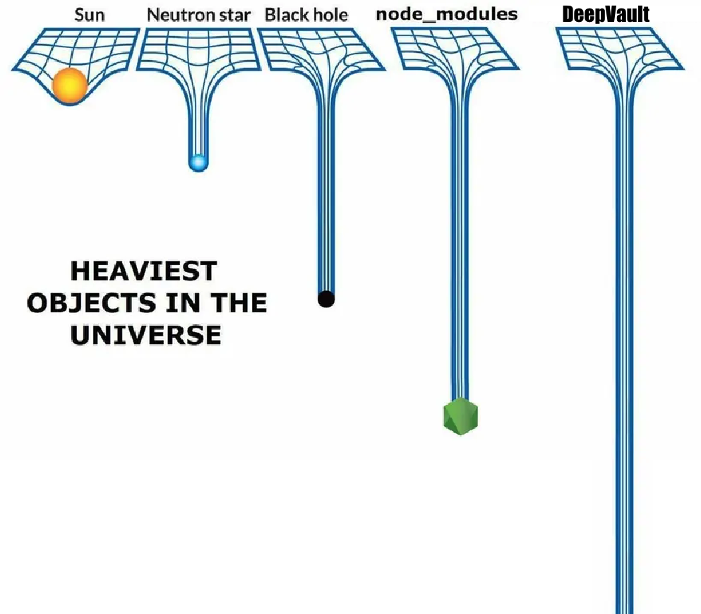

# DeepVault 🌌

**Lock/open a directory as a unbounded cascade-encrypted vault file.**



**Encryption so hard, even space aliens can use it! 🛸**

> ⚠️ **WARNING:** Attempting to crack a `DeepVault` may cause the heat death of your universe. Side effects may include: total entropy, eternal darkness, and regret.

## About

The `vault` command collapses a directory tree into one file: it compresses a deterministic tar, then encrypts the result through a user-chosen stack of unauthenticated ciphers (innermost first). Opening is the reverse — peel the ciphers, locate the deflate stream, inflate, extract — byte-exact.

- 🚫  Zero runtime dependencies (Node builtins only)
- ⚡  Node 22.13+
- 🔇  Prompts are read from a TTY only; secrets are never printed.
- ⚛️  Too few atoms in your universe to brute force the key — I counted.
- 🌌  Remains uncrackable with a multiverse computer.
- 🌈  Includes real protection from rainbows
- 🏆  [Competition below!](#-competition)

## 🔐 Usage

```
vault lock <dir> <vaultfile.vlt>
vault open <vaultfile.vlt> <outdir>
vault list
vault check
```

Two flight verbs (`lock` / `open`), two read-only advisory verbs (`list` / `check`). No telemetry is sent home. There is no home. There is only the vault.

### 📝 Example

> The following example demonstrates how to lock a vault, then open it back up.

The example shows a 5-layer cascading algo stack — `a256-ctr` appears twice (repeats are legal; only the order matters, the vault is a cascade, not a set). Every prompt is typed hidden (no echo): what follows the `:` below is what you type.

### 🔒 `lock`

```shell
# Locking the vault
$ vault lock ~/notes notes.vlt
Stack order (1+ tokens; see 'vault list'): a256-ctr,sm4-cbc,chacha,a256-cbc,a256-ctr
Vault passphrase: Kq7$wZ2!mP9#vR4&nX8@bL5^tY1*dF3gH6+jA0=cE9~sU2%oB7wQ4xT5yN3iH8eJ6m
scrypt N (power of 2; this machine max 32768): 32768
vault: locked 3 file(s) into notes.vlt
```

The boarding sequence. Five prompts, all hidden, in this order:

1. `Stack order (1+ tokens; see 'vault list'):` — comma-separated tokens, innermost first (e.g. `a256-ctr,sm4-ctr`).
2. `Confirm stack order:` — retype the same order. (The vault has no memory of your typos. It is, in this regard, very like space.)
3. `Vault passphrase:` (typed, hidden) — the HEP (High Entropy Password).
4. `Confirm passphrase:`
5. `scrypt N (power of 2; this machine max <max>):` — the KDF cost for this vault, chosen from the machine-verified set shown in the `vault list` footer. It is typed, hidden, and **never written to the file**. It is the third secret. There are three secrets. Memorize the number three.

The vault file is written atomically (`<vaultfile>.tmp` then renamed) and is refused if it already exists. DeepVault does not overwrite. DeepVault does not even acknowledge the existence of the file it refuses to overwrite.

### 🔓 `open`

```shell
# Opening the vault
$ vault open notes.vlt restored
Vault passphrase: Kq7$wZ2!mP9#vR4&nX8@bL5^tY1*dF3gH6+jA0=cE9~sU2%oB7wQ4xT5yN3iH8eJ6m
Stack order (1+ tokens; see 'vault list'): a256-ctr,sm4-cbc,chacha,a256-cbc,a256-ctr
scrypt N (power of 2, as used at lock; this machine max 32768): 32768
vault: opened 3 file(s) from notes.vlt into restored
```

The re-entry sequence. Three prompts:

1. `Vault passphrase:`
2. `Stack order (1+ tokens; see 'vault list'):`
3. `scrypt N (power of 2, as used at lock; this machine max <max>):` — the same N you typed at lock, retyped. A valid-but-different N is just a wrong guess: the same single failure message, no oracle.

Two failure shapes, both reported as one line:

- `vault: wrong passphrase/stack or corrupted/tampered file` — nothing was written (no outdir created).
- `vault: integrity failure — N file(s) fully written before the failure point; inspect <outdir> before deleting` — the tail of the archive was corrupted; N files are complete.

By design the tool cannot tell a wrong passphrase from a tampered or corrupted file — and it cannot tell a wrong scrypt N either: wrong HEP, wrong stack order, wrong depth, and wrong N all collapse to the same single message. I call this "no oracle."

This combined lock/open example demonstrates the HEP (high entropy passphrase) as a 66-char value (floor for chain of 5 cascades is 64); `32768` is the top of the test machine's verified scrypt N set (`vault list` footer).

Test 29 runs this exact transcript — because in this project, even the examples are load-bearing. Tests 18–19 pin the `list` / `check` rendering (test 19 runs this exact 5-token example check).

### 📜 `list`

Prints the ~47-token alphabet grouped by mode, with per-machine availability and the max vault size each token allows. The footer lists the **machine-verified scrypt N values** (every candidate actually probed on this machine, e.g. `32768 (2^15)`) — that list is the menu you pick from when typing N at lock/open. Think of it as the galactic charter of this particular machine.

`list` takes no input — the full 47-token alphabet grouped by machine availability, with the verified scrypt N set in the footer (abridged):

```shell
$ vault list
VAULT ALPHABET — 47 tokens; availability shown for THIS machine

CORE — present in essentially every Node/OpenSSL build
  token     mode  block  max-vault   here
  a128-cbc  cbc   128b   unlimited   yes
  …
  a256-ctr  ctr   128b   unlimited   yes
  …
  chacha    str   —      unlimited   yes

BUILD-DEPENDENT — may be absent in FIPS/minimal/distro builds
  …

NICHE — regional standard, often excluded from Western builds
  sm4-cbc   cbc   128b   unlimited   yes
  …

DEPRECATED — OpenSSL 3.x deprecates 3DES; may not exist in future builds.
Do not use in a new stack unless you accept re-lock risk.
  3des-cbc  cbc   64b    4 GiB       yes
  …

KDF: scrypt r=1 p=1 — machine-verified N on THIS machine: 32768 (2^15) (N is operator-typed per vault: lock and open must be run with the same N)
```

### 🔍 `check`

Prompts for a proposed stack (same format as lock; no HEP needed) and prints an advisory report: one line per token (DEPRECATED marked), the stack ceiling, and a tip. Invalid tokens fail with `vault: stack token not in alphabet: <token>`. The alphabet is closed. The door is sealed. There is no back room.

`check` takes one prompt (a proposed stack — hidden input, no passphrase needed) and prints an advisory report:

```shell
$ vault check
Stack order (1+ tokens; see 'vault list'): a256-ctr,sm4-cbc,chacha,a256-cbc,a256-ctr
  a256-ctr: ok
  sm4-cbc: ok
  chacha: ok
  a256-cbc: ok
  a256-ctr: ok
layer count: 5 -> HEP minimum: 64 chars
max vault size for this stack: unlimited
```

## ⚖️ Constraints & Practice

- **HEP floor.** The passphrase must be at least `max(64, COUNT)` characters, where COUNT is the number of tokens. Checked before any KDF work. This is the minimum sentence length in a language no one else speaks.
- **Stack depth.** Unbounded — the only limits are the per-token ceiling and your patience (each layer is a full scrypt + a full pass over the data). A 300-token stack is legal. Your CPU will remember you.
- **Ceilings.** 64-bit-block tokens (e.g. `3des-cbc`) cap the vault at 4 GiB of file content; other tokens are unlimited. The old 64-bit ships were never built for interstellar cargo.
- **Symlinks and non-regular files are refused** (one line each, exit 1); entry names are limited to 100 UTF-8 bytes. Symlinks are spies; names longer than 100 bytes don't get a boarding pass.
- **scrypt N discipline.** N is a third typed secret — never stored, never auto-selected. Some OpenSSL builds hard-cap the N they will run (this machine: max 32768 = 2^15), so a vault locked at N=2^20 **cannot be opened on a machine whose verified set tops out lower** — the typed N must be in the opening machine's `vault list` footer, or the open fails with the single phase-A message. Check the footer before locking on a machine you might later move away from; N is cheap to retype and fatal to forget. No one can recover it. It was never here.
- **Memory.** lock and open stream; steady-state memory is O(chunk + 512) plus the scrypt scratch area (128·N bytes per KDF call: 4 MiB at N=2^15, 128 MiB at N=2^20). Your RAM is not a suggestion.

## 🧠 HEP — one passphrase keys many layers, and why that's a wall

The HEP (High Entropy Password) is the long passphrase you type — 64+ chars, hidden, never printed. It is not a web-password. Its job is to be long enough that *length alone* makes the search space astronomical. 🪐

**Entropy in plain terms.** Entropy = how many candidates the attacker must consider. Every character multiplies that count by the size of the character set you could have drawn from:

- 64 chars from the 95 printable keyboard chars → 95^64 ≈ 2^420 ≈ 10^126 candidates
- 64 chars from lowercase letters only → 26^64 ≈ 2^301 ≈ 10^90
- a 12-char password from 95 chars → 95^12 ≈ 2^79 — already small; with dictionary structure a real 12-char password is far smaller still

**How one passphrase keys COUNT layers.** DeepVault does not compress the HEP into a single master key that all layers derive from. It **splits the HEP into COUNT contiguous slices** (they cover the HEP exactly, in order) and **stretches each slice with scrypt** into that layer's key + IV:

```
HEP (L chars)  →  slice 1 ‖ slice 2 ‖ … ‖ slice COUNT     (contiguous, exact cover)
slice i        →  scrypt(slice i, salt‖i, N)  →  layer i's key ‖ IV
```

Two properties make this a wall instead of a projection:

1. **No smaller projection to attack.** A design where all layer keys derive from one 32-byte master would let the attacker search 2^256 masters directly — never touching your HEP — so the wall caps at the master's size no matter how long your passphrase is. With sections there is no intermediate object: the only input that reproduces all COUNT layers is the full L-char HEP. Your wall is L × log2(charset) bits, uncapped by HEP length.
2. **Verification is all-or-nothing.** Layer i peels correctly only if slice i is correct — but nothing tells you that until you have peeled all COUNT layers and the innermost content parses as a valid tar. A partial guess (right slice 1, wrong slice 2) is indistinguishable from a fully wrong guess: the same single failure message. The attacker cannot peel "halfway" or layer by layer — every candidate pays the full COUNT×scrypt + full peel, and the only oracle is the very last step.

The per-layer salt (`fileSalt ‖ LE32(layer index)`) keeps every scrypt call distinct even if two slices happened to be equal. The HEP floor `L ≥ max(64, COUNT)` keeps each slice from shrinking to a token as you add layers.

## 🛡️ Security model (deliberately weird)

The ciphers are used **without authentication tags** (no GCM/etc.). The format defends against the practical failures instead:

- R1 (1 KiB–64 KiB random prefix) + R2 (random suffix, 16-aligned) make the deflate offset unguessable and the stream length ambiguous; tampering inside R1 or R2 is a documented blind spot (flip it, the file still opens). Documented because I'm not a monster — even if the padding is.
- Wrong HEP / wrong stack order / wrong depth / wrong scrypt N / tampered early bytes all produce the same single failure message. The vault's one word is "no."
- Three typed secrets (HEP, stack order, scrypt N) are **not stored in the file** — the header is magic + 4 reserved zero bytes + salt; the body is pure ciphertext (verified: 0 of 47 token strings appear in vault bytes).
- Depth is unobservable: the same directory locked with a 3-token and an 8-token stack produces byte-identical M0 when HEP+order match. The file does not know how many layers it has. It never did. Do not ask it.
- mtime (seconds) is preserved on open; the tar is deterministic. Even the timestamps survive re-entry.

## 🕰️ How crackable is this, really?

The honest way to read it: what must the attacker do, and what does that cost in human time? (Spoiler: an insane amount. I'm rounding to keep the README readable.)

**What the attacker holds:** the vault file, this source code, the ~47-token alphabet, the file format — everything public. **What the attacker does not hold:** your HEP (L chars), your stack order (which tokens, which order, how many — depth included), and the N you typed. None of it is in the file, smoothing the attack surface.

**The attacker's walk.** For each candidate (order, HEP, N):

1. Run COUNT scrypts at N (tens of ms each at N=2^15, ~1 s each at N=2^20, each allocating 128·N bytes),
2. Peel COUNT layers over the whole file,
3. Scan the first 128 KiB for the deflate offset,
4. Inflate and check the innermost tar.

Only step 4 tells them anything. There is no layer-by-layer progress: a wrong HEP or wrong order at any depth produces uniform noise the scan rejects, and the file does not reveal how many layers there are — so the walk includes every possible depth: 1 token, 47 tokens, 300 tokens — all of them (47 + 47² + 47³ + … possible orders). "Try the first layer, see if it's right, then the second" is not an option; there is no "right" to see until the end.

**The math, in years.** Take a deliberately *weak* setup: a 1-token stack the attacker fully knows, a 64-char lowercase HEP (2^301 ≈ 10^90 candidates), and an attacker doing 10,000 full guesses per second — each guess already paying one scrypt at N=2^15 plus a full peel (a generous rate for memory-hard work):

```
2^301 / 2^13  ≈  2^288 guesses  ≈  10^86 s  ≈  10^79 years
```

The age of the universe is ~1.4×10^10 years (call it 10^10). That weak setup still needs **~10^69 times the age of the universe** — a 1 followed by 69 zeros of universe-lifetimes. For perspective: the attacker's children, grandchildren, and the 10^60 generations after them will all die wondering. Even our weakest vault outlives every star in the sky.

| Setup | Candidates | Time at 10,000 guesses/s |
| --- | --- | --- |
| 12-char password, *uniform* (no dictionary) | ~2^79 | ~10^12 years — and a real 12-char password is far smaller than 2^79 |
| 64-char HEP, lowercase (known stack) | 2^301 | ~10^79 years |
| 64-char HEP, 95 keyboard chars (known stack) | 2^420 | ~10^114 years |
| + a 2-token stack the attacker does not know | ×47² ≈ ×2,200 | ×2,200 more |
| + the attacker does not know the depth | ×(47 + 47² + … + 47^D) | unbounded multiplier |

At N=2^20 each guess costs ~1000× more KDF work — another ~10^3 in years on every row. At that point the attacker may want to consider an alternative hobby. 🌱

Two honest caveats:

- These are **lower bounds on the attacker's problem**: they ignore the order/depth search (which only adds work), assume a fixed known stack, and fold the per-guess KDF cost into the flat 10k/s rate.
- **The HEP is your responsibility.** The math assumes random characters. A dictionary phrase, a reused password, or 64 chars made of words collapses the candidate count to the number of *likely* phrases — the 64-char floor is a minimum discipline, not a substitute for randomness. A memorable passphrase is a gift to the attacker; a random one is a gift to entropy.

**Quantum computers (Grover).** Grover's algorithm is the standard "quantum future" speedup: search an unstructured N-candidate space in ~√N queries instead of N. The only threat taken seriously is a computer made of qubits and spite, so let's do it justice:

- **Against the ciphers** it is a real design input, and the alphabet reflects it: AES/SM4/Camellia-128 → 64-bit effective under Grover (which is why their 256-bit siblings exist in the alphabet); AES/SM4/Camellia-256 and ChaCha20-256 → 128-bit (considered safe); 2DES (56 → 28-bit) and 3DES (112 → 56-bit) → dead — exactly why both are marked DEPRECATED and capped at 4 GiB vaults.
- **Against the HEP search**, even granting a full Grover speedup on the outer search: 2^420 → 2^210 → ~10^49 years ≈ 10^39 × the age of the universe. And the grant is a fiction: each "query" here is not one hash evaluation but COUNT memory-hard scrypts plus a full file peel. Memory-hard KDFs are chosen precisely because quantum speedups do not amortize the per-guess memory cost, and a machine holding 2^210 × (multi-megabyte scrypt states) in quantum memory is not a plausible machine.

Bottom line: Grover is a serious argument for *which ciphers you stack* (prefer the 256-bit/stream tokens) and a theoretical footnote for the HEP wall.

Go make a cup of tea. The multiverse computer will be thrashing for a bit ⏳

## 🏆 Competition

### $100 to the first person to break the wall

`docs/competition.vlt` is a real DeepVault file locking a directory that contains a single file, `secrets.txt`. Recover its contents.

- **Artifact:** `docs/competition.vlt` — 68,056 bytes, sha256 `363b995b92b8ec7aca61600f82cc019668ab205c62c7c7586475355df0d77695`
- **Built with:** a random 64-token cascade (every 256-bit Grover-hard token repeated ≥ 3×), a 4,096-char HEP split 64 ways — 64 chars per layer — and scrypt N = 32768.
- **What you get:** the vault file and this repository. That is everything: the HEP, the stack order, and the scrypt N are not in the file, and a wrong guess at any of them produces the single no-oracle failure message.
- **Prize:** a $100 electronic gift card to a service of your choice.
- **Submission:** the HEP, the 64-token stack order (innermost first), and the scrypt N that open the vault — or the recovered content of `secrets.txt`. The organizer verifies by replaying `vault open` with your submitted values and byte-comparing the result (see the Usage examples for the exact prompts).

## 🧪 QA — 29 tests, ~40 seconds, zero mercy

**Acceptance suite — `npm test` (29 tests, ~40 s).** The suite drives the real CLI through a pseudo-TTY (`test/pty-run.py`) plus lib-level tests:

- 🔁 round-trip at stack depths 3 / 10 / 16 — byte-exact trees incl. file AND dir mtimes
- 🔐 non-CTR modes (CBC/OFB/CFB, 3DES, Camellia, ChaCha20) round-trip
- 🕵️ known plaintext is absent from vault bytes; the HEP and the stack order are absent from file bytes AND terminal output
- ❌ wrong HEP, wrong order/depth, early tamper → the single phase-A message, no outdir created; late tamper → phase B with the count of complete files
- 🔢 scrypt N discipline: a valid-but-wrong N at open → the same single phase-A message (no oracle); non-power-of-2 and over-machine-max N rejected before any KDF
- 🕳️ R1/R2 blind spots verified: a flipped byte inside R2 is harmless, one inside the deflate is fatal
- 📏 HEP floor `max(64, COUNT)`; ceiling math + boundary; R2 16-alignment formula
- 🌫️ depth unobservability (3- vs 8-token stack → byte-identical M0); fresh salts → different bytes, both open
- 🧱 300-token stack round-trip; every available alphabet token in one cascade (test 26)
- 📝 the Usage examples 5-layer stack (`a256-ctr` twice) round-trips through the pty (test 29)
- 🚫 overwrite refusal, symlink rejection (one line each), missing vaultfile fails before any prompt, piped stdin refused
- 📜 `list` renders all 47 tokens with correct availability; `check` report - invalid-token path; zero runtime deps; `npm run check` gate

**Full cipher matrix — `node tmp/all-tokens.mjs` (53 round-trips).** Every available token as a single-token stack (47 here) + 6 cross-family 2-layer stacks (block⊕stream, OFB/CFB mixes) — each lock → open → byte-exact compare including dir mtimes. Every token flew solo, plus six group flights. This matrix is what caught the dir-mtime restoration bug (fixed in `openVault`: dir mtimes are re-applied after all child writes).

**Verified end-to-end:** all 4 verbs and every failure path through the CLI pty; `vault check` on the full 47-token stack (47 lines, 6 DEPRECATED, HEP min 64, 4 GiB ceiling).

**Known-unverified territory** (the edges of the map, where the cartographers drew a small 🦖 and wrote "here be dragons"):

- Machines that cannot run the N used at lock (verified-set differences — the open then fails with the single phase-A message; check the `vault list` footer before locking)
- All 47×47 pairwise layer combinations (per-cipher behavior is fully covered by the matrix; the peel mechanics are cipher-independent)
- MAulti-GB vaults (5 MB paths are covered at lib level; CLI pty runs use small dirs)

## 🧩 Layout

```
bin/vault.js        CLI entry — the cockpit
lib/mode.js         token alphabet, availability probe, stack parsing, list/check rendering
lib/derive.js       HEP section split + scrypt material derivation
lib/cascade.js      lock/open pipelines, file format (VLT1)
lib/scan.js         bounded deflate-offset scan (open side)
lib/tar.js          deterministic USTAR writer/reader
lib/fsutil.js       directory walk (symlink/type rejection, sorting)
test/vault.test.js  acceptance suite (29 tests), pty-driven via test/pty-run.py
```

## 📦 Requirements

- Node 22.13+ (engines field enforced). If you are still on Node 18, go lie down. It will feel like a lifetime.
- An OpenSSL build exposing the ciphers you stack (`vault list` shows which are present on this machine — availability is a property of *your* machine, not a promise from us).
